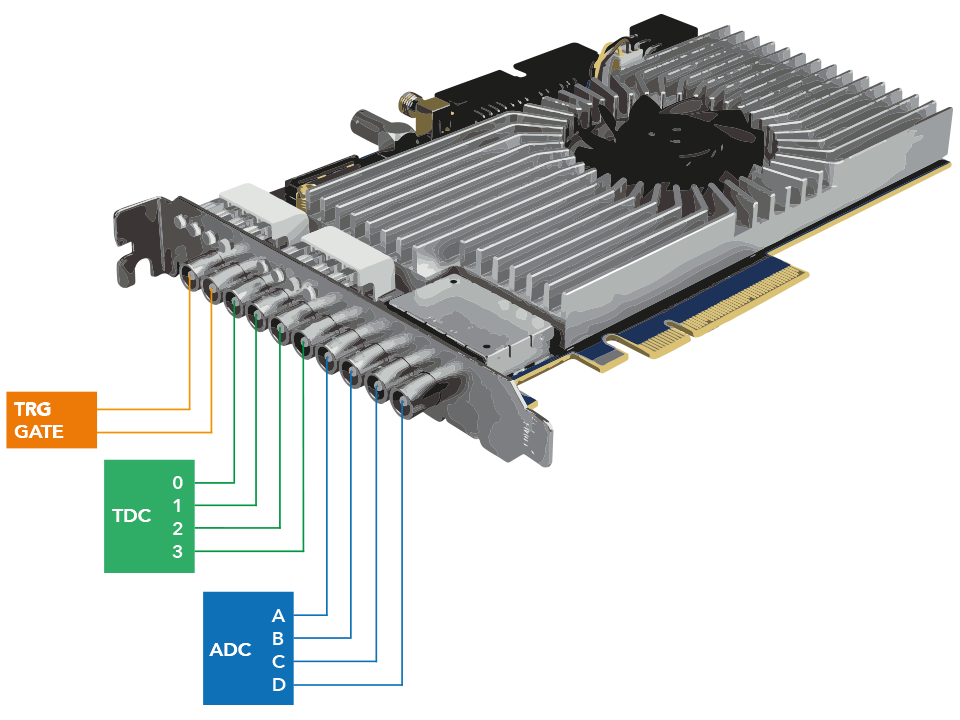
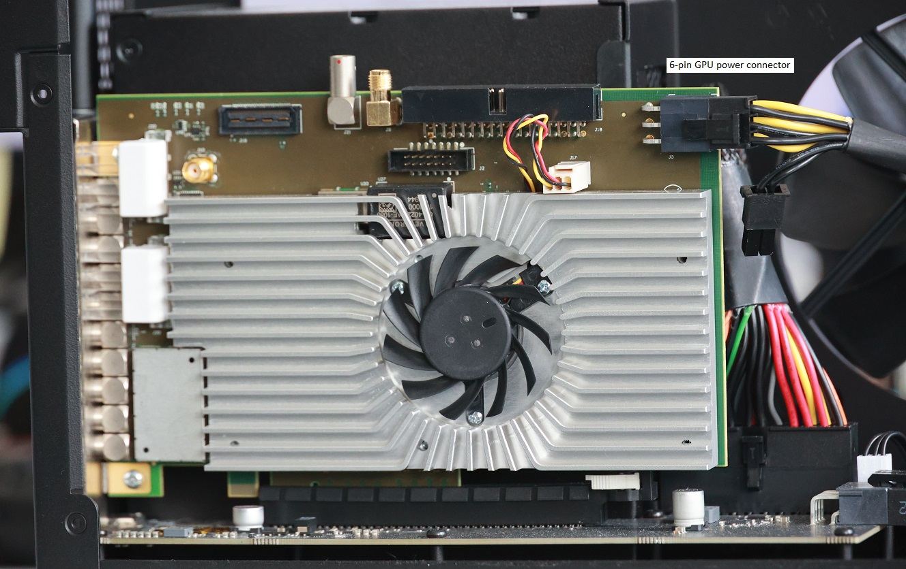

# ndigo6g_babel
Wrappers, Utilities and Examples for using the [Ndigo6G-12](https://www.cronologic.de/products/adcs/ndigo6g-12) with various programming languages.

## License

The code in this repository is licensed under the [Mozilla Public License 2.0](LICENSE). This more or less means that you can do with this code whatever you want, but if you improve the code you shall make your changes available ot others upon request. Please read the license for additional details. 

We encourage you to contribute to this repository. By uploading to this repository you agree to make your changes available under the beforementioned license.

## Directory Structure
    .
    ├── images/     # images used in documentation
    ├── include/    # header files required to use the ndigo6g12_driver DLL
    ├── libs/       # ndigo6g12_driver DLL
    ├── src/        # example applications using the ndigo6g12_driver DLL
    └── tools/      # supporting tools and tool configurations

## Ndigo6G-12 slot cover connections


## Hardware Installation


Insert the Ndigo6G-12 in a x8 or x16 PCI Express 3.0 slot and attach a 6-pin GPU power cable to the rear connector. The Ndigo6G-12 does not work when the power connector is missing. The Ndigo6G-12 will work in PCIe slots with less than 8 lanes or confirming to PCIe 1.0 or 2.0 albeit at reduced maximum data transfer rates.

## Examples
The example applications can be build using the [Clang frontend for LLVM](https://clang.llvm.org/index.html). Easy LLVM installation for Windows is provided by the [Chocolatey project](https://chocolatey.org/): [LLVM Chocolatey package](https://community.chocolatey.org/packages/llvm)

### src/ndigo6g12_averager_example.cpp
Example code to read Ndigo6G-12 Averager data using the ndigo6g12_driver_64.dll.
```
clang++.exe .\src\ndigo6g12_averager_example.cpp -l .\libs\ndigo6g12_driver_64.lib -I .\include\ -o averager.exe
```
### src/ndigo6g12_example.cpp
Example code to read Ndigo6G-12 6.4 Gsps ADC and TDC data using the ndigo6g12_driver_64.dll.
```
clang++.exe .\src\ndigo6g12_example.cpp -l .\libs\ndigo6g12_driver_64.lib -I .\include\ -o ndigo_example.exe
```
